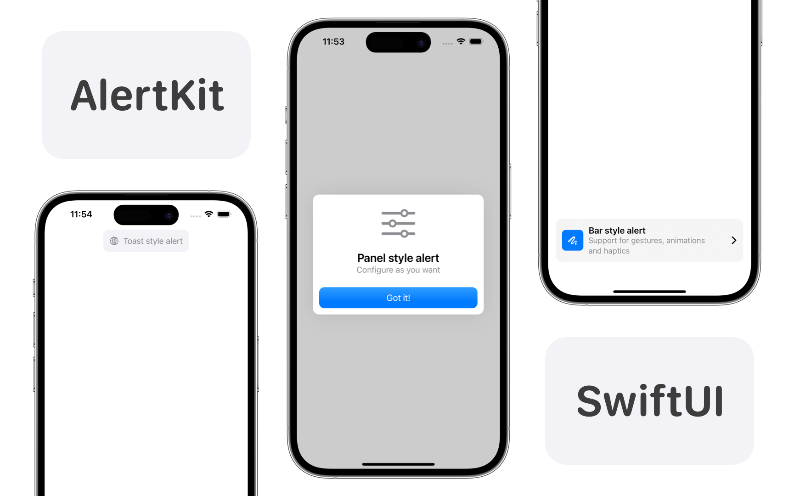

# AlertKit

<p align="center">
    
    
    
    
</p>

AlertKit is a library for SwiftUI that enables the creation of interactive and customized alerts to enhance user experience.

<html>
 <body>
  <p>
    
  </p>
 </body>
</html>

## Features

- Simple implementation as Sheet or fullScreenCover
- Сustomization for every taste
- Support for haptics, gestures and animations

This library is compatible with iOS, macOS, tvOS and watchOS.

## Installing

AlertKit uses Swift Package Manager, so you should use Xcode to add a package dependency for <https://github.com/0xYanis/AlertKit.git>.

Once that completes, import AlertKit into your Swift code wherever needed:

```swift
import AlertKit
```

## Usage

1. Similarly with `sheet` and standard alerts, create a state property of type Bool by changing which it will be possible to show/hide the alert:

```swift
@State var isPresented: Bool = false
```

2. Apply a modifier to the content of your `view`:

```swift
.alertToast("Hello, World!", isPresented: $isPresented)
```

3. If you are interested in customization, then other modifiers are also available to you; In addition to the content shown, you can also change the shape and style of the alert itself.

```swift
.alertToast(
    isPresented: $isPresented,
    timeInterval: 5,
    shape: Capsule(),
    background: Material.ultraThinMaterial,
    haptic: .warning
) {
    HStack {
        Image("Github logo")
        Text("Welcome, User!")
    }
}
```

## List of available alerts

- [alertToast (Small toast at the top of the view)](https://github.com/0xYanis/AlertKit/blob/main/Sources/AlertKit/Alerts/AlertToastViewExtensions.swift)
- [alertPanel (Large panel at the center of the view)](https://github.com/0xYanis/AlertKit/blob/main/Sources/AlertKit/Alerts/AlertPanelViewExtensions.swift)
- [alertBar (Large bar at the bottom of the view)](https://github.com/0xYanis/AlertKit/blob/main/Sources/AlertKit/Alerts/AlertBarViewExtensions.swift)


## Contributing

Contributions to AlertKit are welcome! If you have ideas for improvements or new features, feel free to submit a pull request.

- You must comment your code thoroughly, using documentation comments or regular comments as applicable.
- All code must be licensed under the MIT license so it can benefit the most people.

## License

[MIT Licence](https://github.com/0xYanis/AlertKit/blob/main/LICENSE)

Copyright (c) 2024 Yanis Rybkin.

Permission is hereby granted, free of charge, to any person obtaining a copy of this software and associated documentation files (the "Software"), to deal in the Software without restriction, including without limitation the rights to use, copy, modify, merge, publish, distribute, sublicense, and/or sell copies of the Software, and to permit persons to whom the Software is furnished to do so, subject to the following conditions:

The above copyright notice and this permission notice shall be included in all copies or substantial portions of the Software.

THE SOFTWARE IS PROVIDED "AS IS", WITHOUT WARRANTY OF ANY KIND, EXPRESS OR IMPLIED, INCLUDING BUT NOT LIMITED TO THE WARRANTIES OF MERCHANTABILITY, FITNESS FOR A PARTICULAR PURPOSE AND NONINFRINGEMENT. IN NO EVENT SHALL THE AUTHORS OR COPYRIGHT HOLDERS BE LIABLE FOR ANY CLAIM, DAMAGES OR OTHER LIABILITY, WHETHER IN AN ACTION OF CONTRACT, TORT OR OTHERWISE, ARISING FROM, OUT OF OR IN CONNECTION WITH THE SOFTWARE OR THE USE OR OTHER DEALINGS IN THE SOFTWARE.
